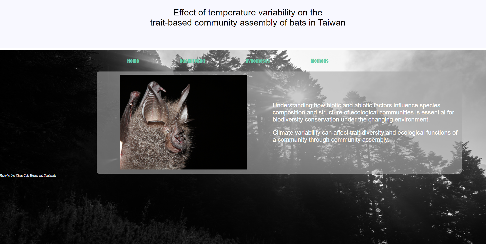

# Bat_project
This webiste is about my thesis concept, "Influences of temperature variability on the trait-based community assembly of bats in Taiwan"

## Preview

**[View Live Preview](/project/bat_frame.html)**

## The basic workframe is following:

Main frame:
[frame](/project/bat_frame.html)

The content:
* [Home](/project/bat1.html)
* [Introduction](/project/Introduction/background_frame.html)
* [Hypothesis](/project/hypothesis/hypothesis.html)
* [Method](/project/method/method_new.html)

